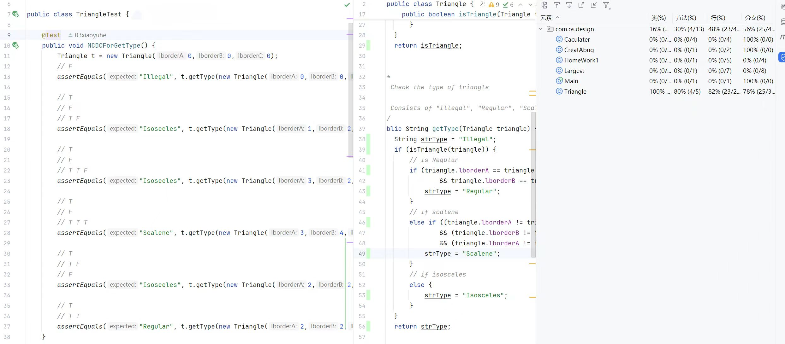

## Triangle - getType()

### 流程图

### 控制流图

### MCDC 覆盖

| 用例 | 输入    | 条件 1 | 组合条件 2 | 组合条件3 | 结果      |
| ---- | ------- | ------ | ---------- | --------- | --------- |
| 1    | {0,0,0} | F      | - -        | - - -     | Illegal   |
| 2    | {1,2,2} | T      | F -        | T F -     | Isosceles |
| 3    | {2,2,3} | T      | F -        | T T F     | Isosceles |
| 4    | {3,4,5} | T      | F -        | T T T     | Scalene   |
| 5    | {2,2,1} | T      | T F        | F - -     | Isosceles |
| 6    | {2,2,2} | T      | T T        | - - -     | Regular   |
|      |         |        |            |           |           |

### 基本路径及其测试用例

| 基本路径          | 是否可行 | 测试用例 | 结果      |
| ----------------- | -------- | -------- | --------- |
| 1 2 11            | 可行     | 1 2 3    | Illegal   |
| 1 2 3 4 5 11      | 可行     | 2 2 2    | Regular   |
| 1 2 3 6 7 9 11    | 可行     | 2 3 3    | Isosceles |
| 1 2 3 6 7 8 9 11  | 可行     | 2 3 2    | Isosceles |
| 1 2 3 6 7 8 10 11 | 可行     | 2 3 4    | Scalene   |
| 1 2 3 4 6 9 11    | 可行     | 2 2 3    | Isosceles |
| 1 2 3 6 9 11      | 不可行   |          |           |

### 编程截图

#### MCDC

#### 基本路径测试

## getLargest()

### 流程图

### 控制流图

### 基本路径及其测试用例

**基本路径** 

(1) **1 - 3 - 4 - 5 - 6 - 10** 

(2) **1 - 2 - 4 - 5 - 6 - 10** 

(3) **1 - 2 - 3 - 4 - 5 - 6 - 10** 

(4) **1 - 2 - 4 - 5 - 6 - 7 - 9 - 6 - 10**

(5) **1 - 2 - 4 - 5 - 6 - 7 - 8 - 9 - 6 - 10**

| 基本路径 | 是否可行 | 测试用例       |
| -------- | -------- | -------------- |
| (1)      | 可行     | array = null   |
| (2)      | 不可行   | 无             |
| (3)      | 可行     | array = []     |
| (4)      | 可行     | array = [2, 1] |
| (5)      | 可行     | array = [1, 2] |
|          |          |                |

### MCDC 覆盖

| 用例 | 输入  | 条件 1 | 条件 2 | 条件 3 | 条件 4 |结果|
| ---- | ----- | ------ | ------ | ------ | ------ |------ |
| 1    | null  | T      | -      | F      | -      |异常|
| 2    | []    | F      | T      | F      | -      |异常|
| 3    | [1,2] | F      | F      | T/F    | T/F    |2|
|      |       |        |        |        |        ||

### 基本路径

(1) **1 - 3 - 4 - 5 - 6 - 10** 

(2) **1 - 2 - 4 - 5 - 6 - 10** 

(3) **1 - 2 - 3 - 4 - 5 - 6 - 10** 

(4) **1 - 2 - 4 - 5 - 6 - 7 - 9 - 6 - 10**

(5) **1 - 2 - 4 - 5 - 6 - 7 - 8 - 9 - 6 - 10**

### 基本路径测试用例

| 基本路径 | 是否可行 | 测试用例       |
| -------- | -------- | -------------- |
| (1)      | 可行     | array = null   |
| (2)      | 不可行   | 无             |
| (3)      | 可行     | array = []     |
| (4)      | 可行     | array = [2, 1] |
| (5)      | 可行     | array = [1, 2] |
|          |          |                |

### 编程截图

#### MCDC

### 基本路径测试

